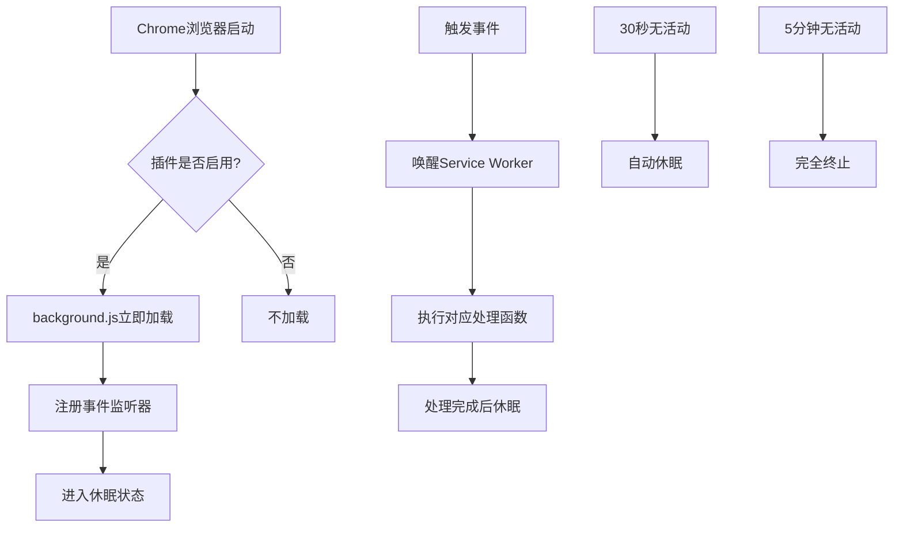
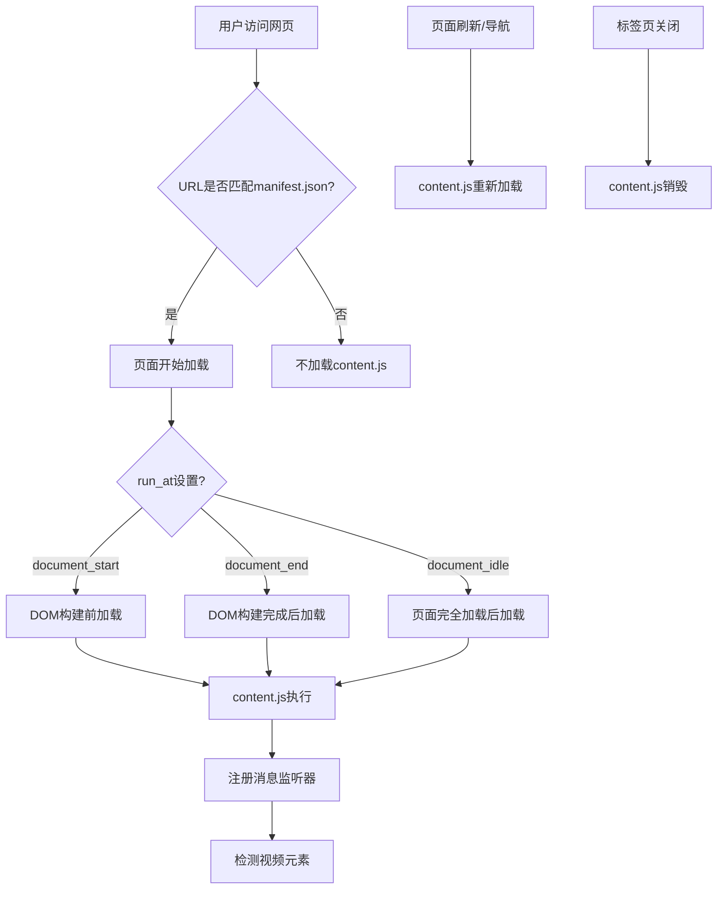
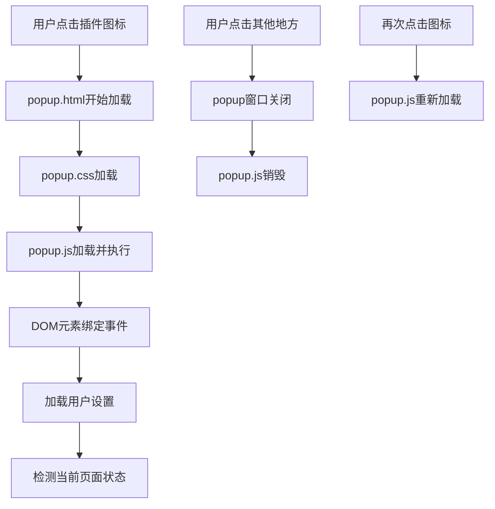
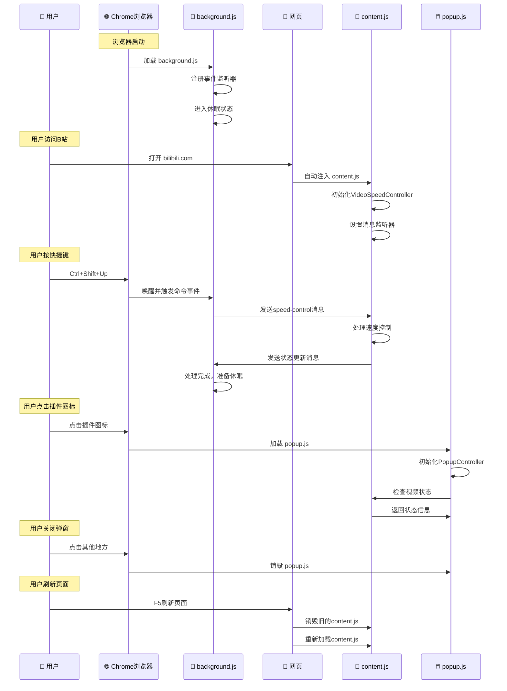

# 🎓 Chrome扩展开发教程

本教程详细介绍Chrome扩展的工作原理、架构模式和文件加载机制，以B站视频倍速插件为例进行说明。

## 📚 目录

1. [Chrome扩展的工作模式](#chrome扩展的工作模式)
2. [JS文件加载时机详解](#js文件加载时机详解)
3. [事件和数据流向图](#事件和数据流向图)
4. [实际开发注意事项](#实际开发注意事项)

---

## 🔄 Chrome扩展的工作模式

### 常见误解

很多开发者认为Chrome扩展总是按照这样的模式工作：
```
用户按快捷键 → background.js → content.js → 操作视频元素
                    ↓
弹出窗口 ← popup.js ← 状态更新消息
```

**实际上，这只是众多可能架构中的一种！** Chrome扩展的工作模式非常灵活，可以根据功能需求采用不同的架构模式。

### 1. **简单的Content Script模式**
```
用户操作页面 → content.js → 直接操作DOM
```

**适用场景：** 页面增强、DOM修改、简单的页面交互

**示例代码：**
```javascript
// 只需要 content.js
// 例如：广告屏蔽、页面美化、文本翻译
document.addEventListener('DOMContentLoaded', () => {
  // 直接操作页面元素
  document.querySelectorAll('.ad').forEach(ad => ad.remove());
});
```

### 2. **纯Background模式**
```
浏览器事件 → background.js → Chrome API操作
```

**适用场景：** 标签页管理、网络请求拦截、系统级功能

**示例代码：**
```javascript
// 主要使用 background.js
// 例如：网络监控、代理设置、请求拦截
chrome.webRequest.onBeforeRequest.addListener(
  (details) => {
    // 拦截和修改网络请求
  },
  {urls: ["<all_urls>"]},
  ["blocking"]
);
```

### 3. **Popup主导模式**
```
用户点击图标 → popup.js → 直接调用Chrome API
                    ↓
                content.js（可选）
```

**适用场景：** 工具类插件、设置面板、快速操作

**示例代码：**
```javascript
// popup.js
document.getElementById('screenshot').addEventListener('click', () => {
  chrome.tabs.captureVisibleTab();
});
```

### 4. **事件驱动模式**
```
网页事件 → content.js → background.js → 其他标签页/API
```

**适用场景：** 跨标签页通信、数据同步、复杂业务逻辑

### 5. **混合架构模式**（如本项目）
```
多个入口点 → 统一的消息中心 → 分发到对应模块
```

**适用场景：** 功能复杂、需要多种交互方式的插件

## 🏗️ 不同类型插件的典型架构

### 📝 **内容增强类插件**
```javascript
// 只需要 content.js
// 例如：广告屏蔽、页面美化、文本翻译
document.addEventListener('DOMContentLoaded', () => {
  // 直接操作页面元素
  document.querySelectorAll('.ad').forEach(ad => ad.remove());
});
```

### 🔧 **工具类插件**
```javascript
// 主要使用 popup.js + background.js
// 例如：密码管理器、截图工具、书签管理

// popup.js
document.getElementById('screenshot').addEventListener('click', () => {
  chrome.tabs.captureVisibleTab();
});
```

### 🌐 **网络监控类插件**
```javascript
// 主要使用 background.js
// 例如：请求拦截、代理设置、网络分析

// background.js
chrome.webRequest.onBeforeRequest.addListener(
  (details) => {
    // 拦截和修改网络请求
  },
  {urls: ["<all_urls>"]},
  ["blocking"]
);
```

### 🎮 **游戏辅助类插件**
```javascript
// content.js + background.js + popup.js
// 例如：自动化脚本、游戏增强、数据统计

// 复杂的消息传递和状态管理
```

## 📊 消息传递的多种模式

### 1. **单向通信**
```javascript
// content.js → background.js
chrome.runtime.sendMessage({action: 'log', data: 'something'});

// background.js → content.js
chrome.tabs.sendMessage(tabId, {action: 'highlight'});
```

### 2. **双向通信**
```javascript
// 请求-响应模式
chrome.runtime.sendMessage({action: 'getData'}, (response) => {
  console.log('收到响应:', response);
});
```

### 3. **广播通信**
```javascript
// 一对多通信
chrome.tabs.query({}, (tabs) => {
  tabs.forEach(tab => {
    chrome.tabs.sendMessage(tab.id, {action: 'update'});
  });
});
```

### 4. **长连接通信**
```javascript
// 持续的双向通信
const port = chrome.runtime.connect({name: "content-background"});
port.postMessage({action: 'start'});
port.onMessage.addListener((msg) => {
  // 处理消息
});
```

## 🎯 架构选择的考虑因素

### **功能复杂度**
- **简单功能**：单一脚本即可
- **中等复杂**：2-3个脚本配合
- **高度复杂**：完整的消息传递架构

### **用户交互方式**
- **被动增强**：主要用content.js
- **主动操作**：需要popup.js
- **快捷键控制**：需要background.js

### **权限需求**
- **页面级操作**：content.js足够
- **浏览器级操作**：需要background.js
- **跨域请求**：需要特殊权限配置

### **性能要求**
- **轻量级**：避免复杂的消息传递
- **高性能**：合理分配计算任务
- **低延迟**：减少不必要的通信

## 💡 最佳实践建议

### 1. **按需选择架构**
```javascript
// 简单的页面修改，不需要复杂架构
if (isSimplePageModification) {
  // 只用 content.js
} else if (needsUserInterface) {
  // content.js + popup.js
} else if (needsSystemIntegration) {
  // background.js + content.js + popup.js
}
```

### 2. **最小化通信开销**
```javascript
// 批量处理消息
const batch = [];
// 收集多个操作
batch.push(operation1, operation2, operation3);
// 一次性发送
chrome.runtime.sendMessage({action: 'batch', operations: batch});
```

### 3. **合理的职责分离**
```javascript
// background.js - 系统级操作
// content.js - 页面级操作  
// popup.js - 用户界面
// options.js - 设置管理
```

---

## 🚀 JS文件加载时机详解

Chrome扩展中不同JS文件的加载时机和生命周期是完全不同的。理解这些加载时机对于开发稳定的扩展至关重要。

### 1. **background.js (Service Worker)** 

#### 加载时机
- ✅ **浏览器启动时**：如果插件已启用
- ✅ **插件安装时**：首次安装后立即加载
- ✅ **插件启用时**：从禁用状态切换到启用
- ✅ **事件触发时**：如果处于休眠状态会被唤醒

#### 生命周期特点
```javascript
// background.js 加载时机示例
chrome.runtime.onStartup.addListener(() => {
    console.log('🚀 浏览器启动 - background.js加载');
});

chrome.runtime.onInstalled.addListener(() => {
    console.log('📦 插件安装 - background.js加载');
});

// 事件监听器注册（立即执行）
chrome.commands.onCommand.addListener(() => {
    console.log('⌨️ 快捷键触发 - 唤醒Service Worker');
});
```

#### Service Worker休眠机制


### 2. **content.js (内容脚本)**

#### 加载时机
```javascript
// manifest.json 配置决定加载时机
{
  "content_scripts": [{
    "matches": ["*://*/*"],           // 🎯 匹配所有网站
    "js": ["content.js"],
    "run_at": "document_end"          // 📍 DOM构建完成后加载
  }]
}

// content.js 加载检测
if (document.readyState === 'loading') {
    document.addEventListener('DOMContentLoaded', () => {
        console.log('📄 DOM加载完成 - content.js初始化');
        new VideoSpeedController();
    });
} else {
    console.log('📄 页面已加载 - content.js立即初始化');
    new VideoSpeedController();
}
```

#### 具体加载场景
- ✅ **新标签页打开匹配的网站**
- ✅ **页面刷新**
- ✅ **页面内导航**（如果URL仍匹配）
- ✅ **动态注入**：`chrome.scripting.executeScript()`

#### 加载时机控制


### 3. **popup.js (弹出窗口脚本)**

#### 加载时机
```javascript
// popup.js 只在弹出窗口打开时加载
document.addEventListener('DOMContentLoaded', () => {
    console.log('🖱️ 用户点击图标 - popup.js加载');
    new PopupController();
});

// 每次打开都是全新的实例
class PopupController {
    constructor() {
        console.log('🆕 PopupController 新实例创建');
        this.init();
    }
}
```

#### 生命周期


## ⏰ 详细加载时序图



## 🔄 动态注入场景

有时候content.js可能没有自动加载，这时需要动态注入：

```javascript
// background.js 中的动态注入逻辑
try {
    // 尝试发送消息
    await chrome.tabs.sendMessage(tab.id, message);
} catch (error) {
    console.log('❌ content.js未加载，开始动态注入...');
    
    // 动态注入content.js
    await chrome.scripting.executeScript({
        target: { tabId: tab.id },
        files: ['content.js']
    });
    
    // 等待初始化完成
    setTimeout(async () => {
        await chrome.tabs.sendMessage(tab.id, message);
    }, 1000);
}
```

## 📊 加载时机对比表

| 文件 | 加载触发 | 生命周期 | 销毁时机 | 重新加载 |
|------|----------|----------|----------|----------|
| **background.js** | 浏览器启动/插件启用 | 持久存在 | 浏览器关闭/插件禁用 | 插件重新加载 |
| **content.js** | 页面加载/动态注入 | 页面级别 | 页面关闭/刷新 | 每次页面加载 |
| **popup.js** | 点击插件图标 | 临时存在 | 弹窗关闭 | 每次打开弹窗 |

---

## 🎯 事件和数据流向图

以下是本项目从用户按下键盘按键开始的完整事件和数据流向图，具体到文件名、函数名和行号：

```mermaid
graph TD
    A[用户按下快捷键<br/>Ctrl+Shift+Up/Down/R] --> B[Chrome浏览器捕获快捷键]
    
    B --> C[background.js:7<br/>chrome.commands.onCommand.addListener]
    
    C --> D[background.js:8<br/>console.log收到快捷键命令]
    
    D --> E[background.js:12<br/>chrome.tabs.query获取当前标签页]
    
    E --> F{标签页是否存在?<br/>background.js:14}
    
    F -->|否| G[background.js:15<br/>console.error无法获取标签页]
    F -->|是| H[background.js:19<br/>尝试发送消息到content.js]
    
    H --> I{消息发送是否成功?<br/>background.js:25}
    
    I -->|成功| J[background.js:26<br/>console.log消息发送成功]
    I -->|失败| K[background.js:28<br/>console.log内容脚本未加载]
    
    K --> L[background.js:31<br/>chrome.scripting.executeScript<br/>注入content.js]
    
    L --> M[background.js:36<br/>setTimeout等待1秒]
    
    M --> N[background.js:38<br/>重新发送消息]
    
    J --> O[content.js:27<br/>chrome.runtime.onMessage.addListener]
    N --> O
    
    O --> P[content.js:28<br/>console.log内容脚本收到消息]
    
    P --> Q{消息action类型?<br/>content.js:30}
    
    Q -->|speed-control| R[content.js:31<br/>this.handleSpeedCommand]
    Q -->|set-speed| S[content.js:34<br/>处理预设速度]
    Q -->|check-video| T[content.js:42<br/>检查视频元素]
    
    R --> U[content.js:58<br/>this.findVideoElement查找视频]
    
    U --> V{是否找到视频?<br/>content.js:60}
    
    V -->|否| W[content.js:61<br/>console.warn未找到视频<br/>content.js:62<br/>this.notifyBackground]
    V -->|是| X{命令类型判断<br/>content.js:66}
    
    X -->|speed-up| Y[content.js:67<br/>this.speedUp]
    X -->|speed-down| Z[content.js:70<br/>this.speedDown]
    X -->|speed-reset| AA[content.js:73<br/>this.resetSpeed]
    
    Y --> BB[content.js:103<br/>检查是否达到最大速度]
    BB -->|未达到| CC[content.js:104<br/>this.currentSpeedIndex++<br/>content.js:105<br/>this.setVideoSpeed]
    BB -->|已达到| DD[content.js:107<br/>console.log已达最大速度<br/>content.js:108<br/>this.showSpeedNotification]
    
    Z --> EE[content.js:118<br/>检查是否达到最小速度]
    EE -->|未达到| FF[content.js:119<br/>this.currentSpeedIndex--<br/>content.js:120<br/>this.setVideoSpeed]
    EE -->|已达到| GG[content.js:122<br/>console.log已达最小速度<br/>content.js:123<br/>this.showSpeedNotification]
    
    AA --> HH[content.js:131<br/>this.currentSpeedIndex = 3<br/>content.js:132<br/>this.setVideoSpeed]
    
    CC --> II[content.js:140<br/>video.playbackRate = speed]
    FF --> II
    HH --> II
    
    II --> JJ[content.js:141<br/>this.currentSpeed = speed]
    JJ --> KK[content.js:143<br/>console.log播放速度已设置]
    KK --> LL[content.js:144<br/>this.showSpeedNotification]
    LL --> MM[content.js:147<br/>this.notifyBackground]
    
    LL --> NN[content.js:156<br/>移除现有通知元素]
    NN --> OO[content.js:161<br/>创建新通知元素]
    OO --> PP[content.js:175<br/>document.body.appendChild]
    PP --> QQ[content.js:178<br/>setTimeout 3秒后移除]
    
    MM --> RR[content.js:217<br/>chrome.runtime.sendMessage<br/>发送到background.js]
    
    RR --> SS[background.js:56<br/>chrome.runtime.onMessage.addListener]
    SS --> TT[background.js:57<br/>console.log后台脚本收到消息]
    TT --> UU{消息action类型?<br/>background.js:60}
    
    UU -->|speed-changed| VV[background.js:61<br/>console.log播放速度已更改]
    UU -->|video-not-found| WW[background.js:65<br/>console.warn未找到视频元素]
    UU -->|其他| XX[background.js:69<br/>console.log未知消息类型]
    
    VV --> YY[background.js:73<br/>sendResponse success: true]
    WW --> YY
    XX --> YY
    
    W --> ZZ[background.js:65<br/>console.warn未找到视频元素]
    
    style A fill:#ff9999
    style II fill:#99ff99
    style PP fill:#9999ff
    style YY fill:#ffff99
```



### 🔍 详细流程说明

#### **🎯 第一阶段：快捷键捕获**
1. **用户操作**：按下 `Ctrl+Shift+Up/Down/R`
2. **Chrome捕获**：浏览器识别快捷键
3. **background.js:7**：`chrome.commands.onCommand.addListener` 触发

#### **📡 第二阶段：消息传递**
4. **background.js:12**：获取当前活动标签页
5. **background.js:19**：尝试发送消息到content.js
6. **失败处理**：如果失败，在第31行注入content.js脚本

#### **🎮 第三阶段：命令处理**
7. **content.js:27**：接收消息监听器触发
8. **content.js:31**：调用 `handleSpeedCommand` 函数
9. **content.js:58**：调用 `findVideoElement` 查找视频

#### **⚡第四阶段：速度控制**
10. **content.js:67/70/73**：根据命令类型调用对应函数
11. **content.js:140**：核心操作 `video.playbackRate = speed`
12. **content.js:144**：显示通知给用户

#### **🔄 第五阶段：状态反馈**
13. **content.js:147**：通知后台脚本状态变化
14. **background.js:56**：后台接收状态更新
15. **background.js:73**：发送响应确认

### 🎨 颜色说明
- 🔴 **红色**：用户输入事件
- 🟢 **绿色**：核心业务逻辑
- 🔵 **蓝色**：UI更新操作  
- 🟡 **黄色**：响应和反馈

---

## 🎯 实际开发注意事项

### 1. **background.js 休眠机制**
```javascript
// ❌ 错误：试图保持长期运行
setInterval(() => {
    console.log('保持活跃'); // 这会被Chrome终止
}, 1000);

// ✅ 正确：事件驱动
chrome.commands.onCommand.addListener(() => {
    // 只在需要时执行
});
```

### 2. **content.js 重复加载**
```javascript
// ❌ 错误：没有检查是否已加载
new VideoSpeedController();

// ✅ 正确：防止重复初始化
if (!window.videoSpeedControllerLoaded) {
    window.videoSpeedControllerLoaded = true;
    new VideoSpeedController();
}
```

### 3. **popup.js 状态管理**
```javascript
// ❌ 错误：假设状态持久存在
let currentSpeed = 1.0; // 每次打开都会重置

// ✅ 正确：从storage加载状态
async loadCurrentSpeed() {
    const result = await chrome.storage.local.get(['currentSpeed']);
    return result.currentSpeed || 1.0;
}
```

### 4. **消息传递最佳实践**
```javascript
// ✅ 正确：处理消息传递异常
async function sendMessageSafely(tabId, message) {
    try {
        return await chrome.tabs.sendMessage(tabId, message);
    } catch (error) {
        if (error.message.includes('Could not establish connection')) {
            // 内容脚本未加载，尝试注入
            await chrome.scripting.executeScript({
                target: { tabId },
                files: ['content.js']
            });
            
            // 等待初始化后重试
            await new Promise(resolve => setTimeout(resolve, 1000));
            return await chrome.tabs.sendMessage(tabId, message);
        }
        throw error;
    }
}
```

### 5. **性能优化建议**
```javascript
// ✅ 防抖处理频繁操作
function debounce(func, delay) {
    let timeoutId;
    return function (...args) {
        clearTimeout(timeoutId);
        timeoutId = setTimeout(() => func.apply(this, args), delay);
    };
}

// 使用防抖处理快捷键
const debouncedSpeedControl = debounce(handleSpeedCommand, 200);
```

## 📝 总结

通过本教程，您应该了解到：

1. **Chrome扩展的架构模式是灵活的**，不是固定的模式
2. **不同JS文件有不同的加载时机和生命周期**
3. **消息传递机制是扩展各部分通信的核心**
4. **理解加载时机对于开发稳定的扩展至关重要**
5. **实际开发中需要处理各种异常情况**

这些知识将帮助您开发出更加稳定、高效的Chrome扩展程序。

---

**🎉 恭喜您完成了Chrome扩展开发教程！**

如有疑问，请参考：
- [Chrome扩展开发文档](https://developer.chrome.com/docs/extensions/)
- [Manifest V3 迁移指南](https://developer.chrome.com/docs/extensions/migrating/)
- 项目的 `DEVELOPMENT.md` 文件 